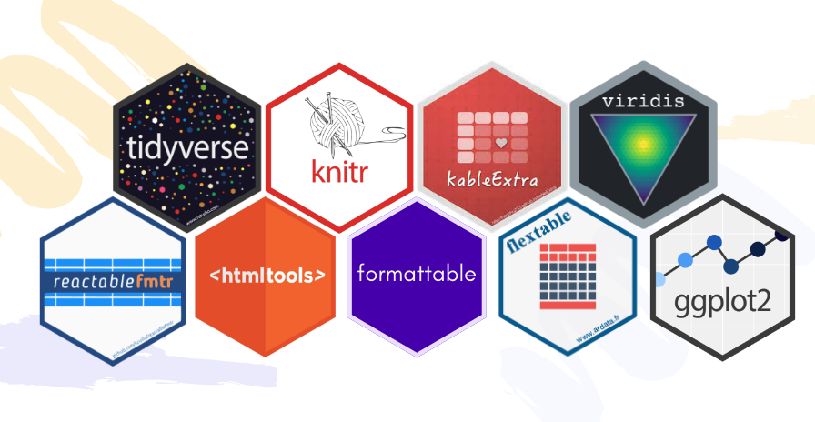

# Transform your R Dataframes: Styles, 🎨 Colors, and 😎 Emojis

In this repository, we will explore a method to add 🎨colors and 🖌️styles in R DataFrames. We will focus on the application of colors and emojis, using approaches similar to the popular conditional formatting commonly used in pivot tables within spreadsheets. Through this strategy, we aim to improve the presentation of our data, making the exploration and understanding of the information not only informative but also visually attractive.

# What libraries can I use to style my R dataframes?
The R libraries used to create this article are as follows:

| Library           | Description      |
|-------------------|-----------------------------|
| 1. 🔍 **tidyverse**    | It integrates various R libraries for data manipulation, graphics, and analysis, promoting clear and efficient code. |
| 2. 📝 **knitr**         | Automates the generation of dynamic reports.                          |
| 3. 📝 **kableExtra**    | An additional extension that enhances table presentation in R Markdown documents with extra formatting options.|
| 4. 📄 **reactablefrmtr**| Incorporates functions to craft interactive and flexible tables in R, featuring filtering, sorting, and search functionalities.|
| 5. ✏️ **htmltools** | Offers functions to build and manipulate HTML objects in R.    |
| 6. 📄 **formattable**   | Equipped with functions for formatting and customizing tables in R.|
| 7. 📄 **flextable**     | Another library enabling the creation of flexible and customizable tables in R, with advanced formatting options for documents and presentations.|
| 8. 📊 **ggplot2**       | Among the most popular R visualization libraries, it produces appealing and comprehensible graphs. |
| 9. 🎨 **viridis**       | A R library for creating visually appealing color maps. |

---

These libraries empowered me to employ functions for generating HTML-style representations of DataFrames. This capability enables customization of DataFrame visual appearance during viewing.
The functions employed in the code in this repository facilitate the highlighting, coloring, and formatting of cells based on specific conditions. This makes it effortless to visually identify patterns and trends within datasets.

---

# 🚀 R Code

If you wish to review the code, you can explore this [R notebook](https://r0mymendez.github.io/r-dataframe-styles/) 

---
 

